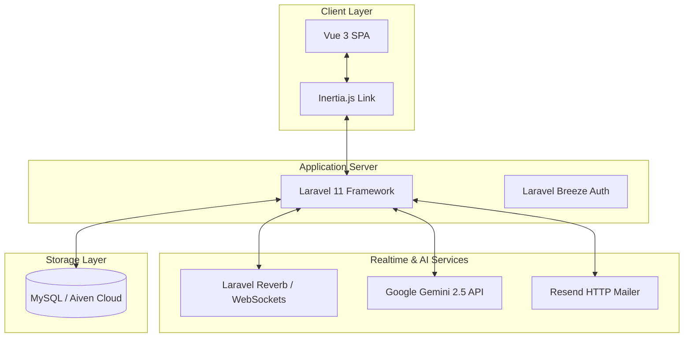
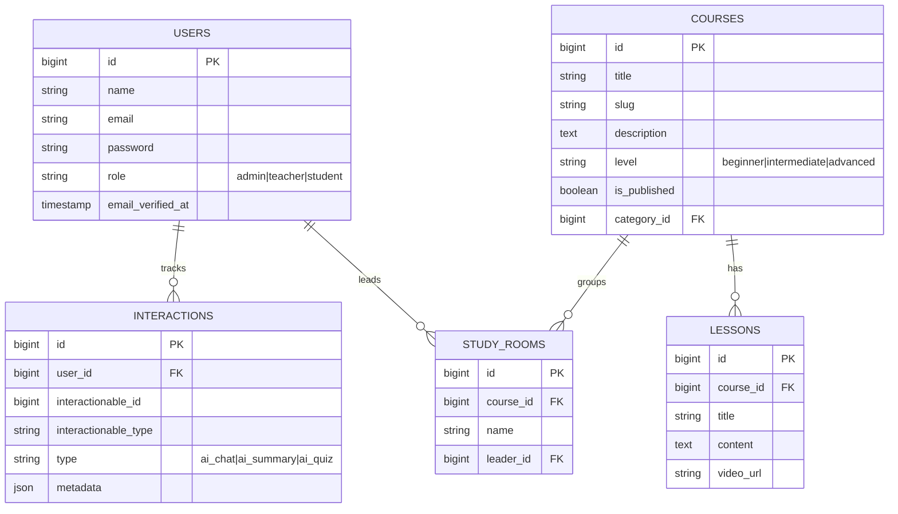

# Product Requirement Document (PRD) - Course Platform (منصة كورس)

## 1. Document Control & Overview

| Project Name | Course Platform (منصة كورس) |
|---|---|
| **Author** | Antigravity AI |
| **Status** | Approved |
| **Target Launch** | Q2 2026 |
| **Tech Stack** | Laravel (PHP), Inertia.js (Vue.js), Tailwind CSS, MySQL, Pusher/Laravel Reverb, Google Gemini API |

---

## 2. Project Vision & Goals

**Course (منصة كورس)** is an advanced, highly personalized, and interactive e-learning platform specifically tailored for Arabic-speaking tech students. The platform goes beyond traditional static video-based learning by integrating collaborative real-time study rooms, AI-powered personal mentorship, and automated technical scanning to ensure teaching material is always up-to-date.

### Core Strategic Goals:
*   **Active Peer Learning:** Foster student-to-student collaboration via synchronous collaborative Study Rooms with drawing boards, live reactions, and hands-on moderation.
*   **Empowered AI Mentorship:** Offer a 24/7 personal tutor that answers questions, synthesizes notes, generates customized roadmap pathways, and conducts realistic mock job interviews.
*   **Automated Quality Assurance:** Enable administrators to run AI-based content scans that detect deprecated code, obsolete packages, and bad programming patterns in lessons.

---

## 3. Target User Roles & Personas

### A. The Student (الطالب)
*   **Goal:** Learn coding and technical disciplines, track their personal milestones, collaborate with peers, and get immediate answers to programming doubts.
*   **Key Pain Point:** Staying motivated when learning alone; encountering obsolete code in video lessons; lack of interview preparation.

### B. The Instructor/Teacher (المعلم)
*   **Goal:** Author high-quality courses, create interactive quizzes and coding challenges, keep track of student analytics, and moderate social interactions.
*   **Key Pain Point:** Correcting dozens of repetitive queries, managing student comments, tracking engagement manually.

### C. The Platform Administrator (المدير)
*   **Goal:** Manage instructor accounts, monitor overall growth and sales, and run content health scans to maintain curriculum prestige.
*   **Key Pain Point:** Manually reviewing hundreds of code snippets inside lessons for accuracy and deprecations.

---

## 4. System Architecture & Tech Stack

### Stack Components:
1.  **Frontend SPA:** Vue 3 Composition API using Vite as bundler, styled with Vanilla CSS and Tailwind CSS.
2.  **Inertia.js:** Glues Vue 3 and Laravel together without building a separate REST API, retaining full backend routing and auth.
3.  **Real-Time Layer:** Laravel Reverb (WebSocket server) for high-performance, real-time synchronization in Study Rooms.
4.  **AI Engine:** Google Gemini API (`gemini-2.5-flash` and `gemini-1.5-flash-latest` models) for chat, roadmap generator, quiz generator, and content quality auditing.
5.  **SMTP/Transactional Mail:** Resend HTTP API Client for high-speed, reliable transactional mail delivery.

---

## 5. Core Feature Specifications

### 5.1 Registration & Authentication (معالجة التسجيل التلقائي)
*   **Description:** Students can register with email and password.
*   **Special Enhancement:** Because email delivery may experience latency in different deployment environments (e.g., serverless Vercel), registrations are now **Auto-Verified** at creation. Users are logged in immediately and redirected to the dashboard without waiting for email confirmation, while maintaining the verification structure for future extensions.

### 5.2 Dynamic Dashboard & Personalization (لوحة التحكم المخصصة)
*   **Personalization Algorithm:** The dashboard dynamically scans the student's custom *Learning Goal* (e.g., "تعلم جافا"). It runs a smart keyword search against all published courses in Arabic to recommend matching pathways. If no goal is defined or no courses match, it gracefully falls back to the latest popular tracks.
*   **Gamification Stats:**
    *   *Enrolled tracks count.*
    *   *Completed lessons progress.*
    *   *Learning hours estimator* (0.5h per completed lesson).
    *   *Point System* (Base points of 150 + 10 points per completed lesson).

### 5.3 Interactive Study Rooms (غرف الدراسة التفاعلية)
*   **Sync State Engines:** Provides digital spaces where students studying the same course can collaborate in real-time.
*   **Synchronous Features:**
    *   **Live Chat & Reactions:** Instant messaging with custom learning emojis.
    *   **Shared Canvas (Whiteboard):** Dynamic drawing inputs broadcast to room peers for diagramming code concepts.
    *   **Leadership System:** Users can claim room leadership to direct the session focus.
    *   **Hand Raising (رفع اليد):** Interactive queuing system to manage speaking/drawing order.
    *   **Timed Comments:** Post comments pinned to specific timestamps of the course lectures.

### 5.4 AI Personal Mentor Hub (مركز المساعد الشخصي الذكي)
Equipped with `gemini-2.5-flash` model integration, this includes five powerful tools:
1.  **AI Chatbot (المدرب الشخصي):** General learning assistant configured with system prompts that refer to the student by name and customize replies to their specified goals.
2.  **Context-Aware Lesson Chat:** When loaded inside a specific lesson page, the AI is supplied with the entire lesson content. It is strictly constrained to answer questions **only** about that lesson, politely declining out-of-bounds requests.
3.  **Automatic Summaries (التلخيص الفوري):** Reads lesson text and translates it into an aesthetic Markdown summary showing the core idea, structured key points, and terminology definitions.
4.  **Interactive Quizzes (إنشاء الاختبارات):** Generates 3 custom multiple-choice questions on-the-fly based on lesson content. Includes interactive options, correct answer validation, and comprehensive explanations for correct choices.
5.  **Personal Roadmap Builder (خارطة الطريق):** Takes a custom learning goal, level (Beginner/Intermediate/Advanced), and daily time availability to dynamically generate a scheduled weekly study plan choosing only from the course catalog.
6.  **Mock Technical Interviews (محاكاة مقابلة العمل):** Acts as a professional technical recruiter. Prompts questions one-by-one based on the lesson catalog, evaluates student answers, and guides them through feedback.

### 5.5 Administrator Code & Content Quality Scanner (فاحص الجودة الذكي)
*   **Description:** An administrative panel built to maintain elite curriculum quality.
*   **Mechanism:** The Admin selects any course. The system fetches all course lesson texts, filters out HTML markups, and feeds the corpus to the Google Gemini model.
*   **Outcome:** The model compiles a robust JSON array list containing:
    *   **Deprecated Tech/Libraries:** Obsolete syntax or patterns.
    *   **Severity Tier:** Low, Medium, or High risk.
    *   **Specific Lesson:** Where the issue was located.
    *   **Recommended Modern Alternative:** Safe paths for updating.

### 5.6 Timed Comments & Custom Lesson Notes (الملاحظات والتعليقات الزمنية)
*   **Custom Lesson Notes:** Rich notes written by students during studies that can be compiled, saved, deleted, and exported as a clean text file for local review.
*   **Timed Comments:** Social engagement that lets students leave comments pinned to exact seconds in a video lesson, creating a contextual forum for specific sections of a lecture.

---

## 6. Key Database Schema Details

---

## 7. Future Product Roadmap

1.  **AI Automated Translation:** Automatic Arabic subtitling and translations for foreign technical contents.
2.  **Live Video Streaming:** Peer-to-peer visual sessions in study rooms via WebRTC/LiveKit integrations.
3.  **Automated Lab Sandboxes:** Integration of in-browser terminal sandboxes so students can compile code on-the-fly directly next to the lesson screen.
4.  **Teacher AI Copilot:** Tooling to automatically generate complete lesson outlines, quizzes, and scripts based on single-sentence topics.
